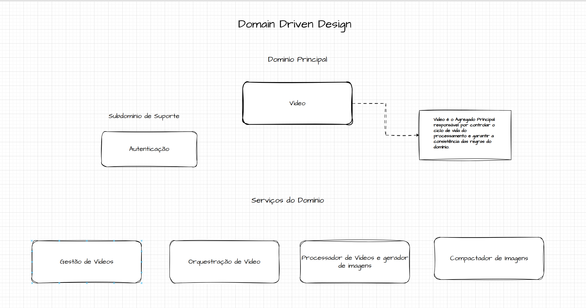
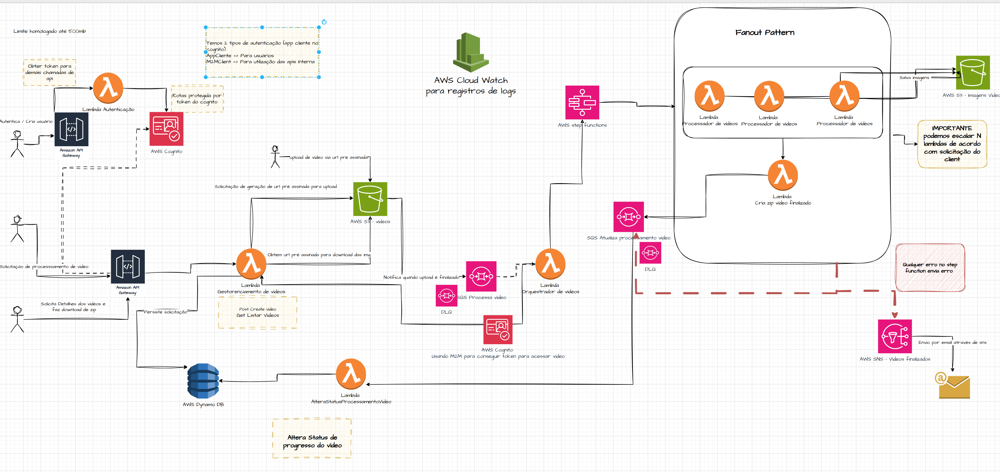
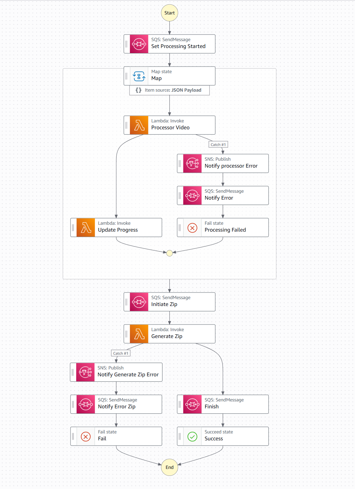
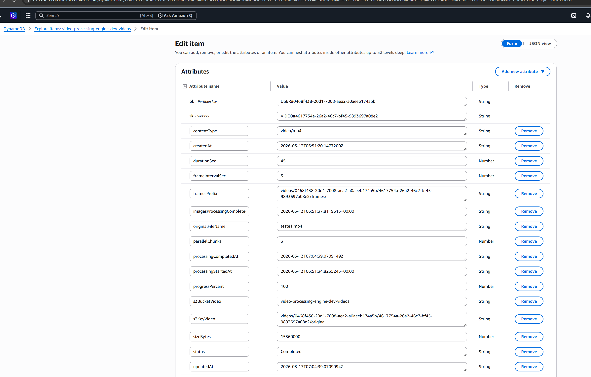
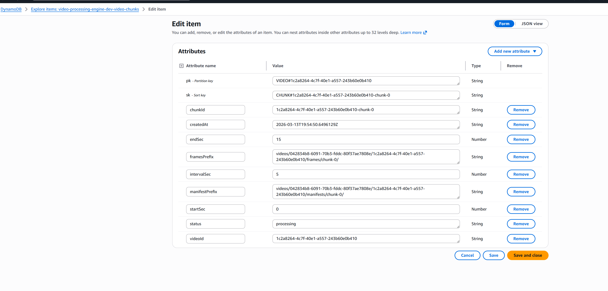

# Video Processing Engine — Infraestrutura

Repositório de **Infraestrutura como Código (IaC)** do projeto **Video Processing Engine**, parte do Hackathon FIAP Pós Tech em Arquitetura de Software. Provisiona a infraestrutura AWS via Terraform (API Gateway, Cognito, DynamoDB, S3, SNS, SQS, Step Functions, Lambdas em casca, CloudWatch).

Este repositório **cria recursos de infraestrutura** e não realiza deploy do código das aplicações (cada Lambda possui seu próprio repositório).

---
## 🚀 Deploy dos Serviços

Após a criação da infraestrutura, é necessário executar o deploy de cada serviço através das GitHub Actions correspondentes.

- 🔐 **Autenticação**  
  Executar a action de deploy:  
  https://github.com/diegoknsk/video-processing-engine-auth-lambda  

- 🎬 **Gestão de Vídeos**  
  Executar a action de deploy:  
  https://github.com/diegoknsk/video-processing-engine-video-management-lambda  

- ⚙️ **Orquestrador do Processo de Vídeos**  
  Executar a action de deploy:  
  https://github.com/diegoknsk/video-processing-engine-video-orchestrator-lambda  

- 🖼️ **Processador de Vídeos (extração de imagens)**  
  Executar a action de deploy:  
  https://github.com/diegoknsk/video-processing-engine-video-processor-lambda  

- 📦 **Compactador de Imagens (finalização)**  
  Executar a action de deploy:  
  https://github.com/diegoknsk/video-processing-engine-video-finalizer-lambda  

## 1. Visão Geral da Solução

O **Video Processing Engine** é uma solução serverless para **processamento distribuído de vídeos** na AWS. O objetivo central é receber vídeos enviados por usuários, extrair frames em paralelo (chunks) e entregar o resultado compactado, com rastreamento completo de estado e notificação ao final do processamento.

Principais características da abordagem:

- **Serverless:** toda a computação é baseada em AWS Lambda e Step Functions — sem servidores para gerenciar, com escalonamento automático conforme demanda.
- **Paralelismo (fan-out / fan-in):** o vídeo é dividido em chunks processados simultaneamente via Map State na Step Functions, reduzindo drasticamente o tempo total de processamento.
- **Arquitetura inspirada em ~80% Clean Architecture:** cada serviço possui responsabilidades bem delimitadas, com separação entre domínio, casos de uso e infraestrutura; adaptada para o contexto serverless/Lambda.
- **Escalabilidade horizontal automática:** componentes stateless escalam independentemente; DynamoDB e S3 não possuem limites práticos de capacidade para o volume esperado.
- **Desacoplamento entre serviços:** comunicação exclusivamente por eventos (SNS/SQS), sem chamadas síncronas diretas entre serviços de domínio distintos.

---

## 2. Modelagem de Domínio (DDD)



A modelagem segue princípios de **Domain-Driven Design**, com os seguintes elementos centrais:

- **Domínio principal — Processamento de Vídeos:** concentra toda a lógica de negócio relacionada ao ciclo de vida do processamento.
- **Agregado Principal — `Video`:** representa a entidade central do domínio; é responsável pelo ciclo de vida completo do processamento (criação, divisão em chunks, acompanhamento de progresso, finalização e notificação).
- **Subdomínio de suporte — Autenticação:** trata da identidade do usuário via Cognito; não pertence ao núcleo de negócio, mas é necessário para o acesso seguro à API.
- **Serviços distribuídos:**
  - **Gestão de Vídeos** — recebe requisições da API, persiste metadados e gera URL pré-assinada para upload no S3.
  - **Orquestração** — consome eventos de upload e inicia o fluxo de processamento na Step Functions.
  - **Processamento** — extrai frames do vídeo por chunk de forma paralela.
  - **Compactação (Finalizer)** — agrega os frames gerados e produz o arquivo zip final.

---

## 3. Arquitetura da Solução



A solução é **orientada a eventos**, com os seguintes componentes AWS principais:

| Componente | Papel |
|---|---|
| **API Gateway (HTTP API)** | Ponto de entrada das requisições REST; valida o token JWT via authorizer Cognito. |
| **Cognito** | Gerencia autenticação e emissão de tokens JWT para os usuários. |
| **Lambda (Video Management)** | Persiste metadados no DynamoDB e gera URL pré-assinada para upload no S3. |
| **S3** | Armazena os vídeos enviados, os frames extraídos (por chunk) e o zip final. |
| **SNS** | Publica eventos de domínio: `video-submitted`, `video-completed`, `video-processing-error`. |
| **SQS** | Filas de desacoplamento para processamento, atualização de status e finalização; inclui DLQs. |
| **Lambda (Orchestrator)** | Consome a fila SQS e inicia a execução da State Machine na Step Functions. |
| **Step Functions** | Orquestra o fluxo de processamento com suporte a execução paralela (Map State). |
| **Lambda (Processor)** | Extrai frames do chunk de vídeo e persiste no S3. |
| **Lambda (Finalizer)** | Compacta todos os frames extraídos e persiste o zip no S3. |
| **DynamoDB** | Armazena metadados, status e progresso de cada vídeo processado. |

**Características arquiteturais:**

- **Orientada a eventos:** nenhum serviço chama diretamente outro serviço de domínio; a comunicação ocorre via SNS/SQS.
- **Fan-out / fan-in:** o processamento de chunks é disparado em paralelo (fan-out via Map State) e consolidado ao final (fan-in na Lambda Finalizer).
- **Desacoplamento total:** a Lambda Orchestrator, o Processor e o Finalizer são acionados por eventos, não por chamadas diretas — cada um pode evoluir ou escalar de forma independente.

---

## 4. Orquestração e Paralelismo



A **State Machine** na Step Functions é o coração do processamento distribuído:

1. **Divisão em chunks:** ao iniciar, o fluxo recebe o vídeo e o divide em segmentos (chunks) conforme configuração.
2. **Execução paralela (Map State):** cada chunk é processado de forma simultânea e independente pela Lambda Processor — extraindo frames e persistindo no S3. Isso reduz o tempo total de processamento de forma linear conforme o número de chunks.
3. **Atualização de progresso:** ao concluir cada chunk, o status do vídeo no DynamoDB é atualizado, permitindo rastreamento em tempo real do progresso.
4. **Geração do arquivo compactado final:** após todos os chunks serem processados (fan-in), a Lambda Finalizer é invocada para consolidar os frames e gerar o zip final no S3.
5. **Notificação de conclusão:** ao finalizar, o evento `video-completed` é publicado no SNS, podendo acionar notificações externas (ex.: e-mail via subscrição SNS).

---

## 5. Banco de Dados

**Tabela principal — metadados e status do vídeo:**



**Tabela de detalhes — chunks e progresso:**



### Por que DynamoDB (chave-valor)?

O DynamoDB foi escolhido como banco de dados principal por ser o mais adequado para o perfil de acesso e escala desta solução:

| Critério | Justificativa |
|---|---|
| **Alta velocidade de leitura e escrita** | Latência de milissegundos em qualquer escala; essencial para rastreamento em tempo real de eventos de processamento. |
| **Baixa latência** | Acesso por chave primária em O(1); nenhuma query complexa é necessária para o fluxo de processamento. |
| **Grande volume de eventos** | Cada chunk processado gera uma atualização de status; o volume de escritas cresce proporcionalmente ao paralelismo. |
| **Estrutura dinâmica e flexível** | Schema-less permite evoluir os atributos de metadados sem migrações; chunks de vídeos distintos podem ter atributos diferentes. |
| **Escalabilidade horizontal automática** | Capacidade provisionada ou on-demand ajusta automaticamente sem intervenção operacional. |
| **Aderência à arquitetura orientada a eventos** | Integração nativa com Streams DynamoDB para captura de mudanças; sem necessidade de pooling ou transações longas. |

---

## 6. Deploy da Solução

O processo de deploy segue a seguinte sequência:

1. **Configurar variáveis de infraestrutura:** preencher o arquivo `terraform/envs/dev.tfvars` com os valores específicos do ambiente (região, prefixo, lab_role_arn, etc.) conforme instruções detalhadas na seção [Variáveis importantes](#variáveis-importantes) e nos READMEs de cada módulo.

2. **Provisionar a infraestrutura:** executar a GitHub Action **Terraform Apply** neste repositório. Isso criará todos os recursos AWS (S3, DynamoDB, SNS, SQS, Cognito, Lambdas em casca, API Gateway, Step Functions).

3. **Obter dados do Cognito (primeira execução):** após o `terraform apply`, os outputs do Cognito são gerados automaticamente. Recuperar os valores de:
   - `cognito_user_pool_id`
   - `cognito_client_id`
   - `cognito_issuer`
   - `cognito_jwks_url`

4. **Configurar os serviços dependentes:** com os dados do Cognito obtidos no passo anterior, configurar as variáveis de ambiente nos repositórios:
   - **Serviço de autenticação (Lambda Auth)**
   - **Gestão de vídeos (Lambda Video Management)**
   - **Orquestrador (Lambda Orchestrator)**

5. **Executar as actions de deploy dos serviços:** após configurar cada repositório de Lambda com as variáveis corretas, disparar os workflows de deploy em cada repositório para publicar o código nas Lambdas em casca criadas pela infraestrutura.

> **Importante:** o deploy dos serviços (passo 5) só funciona corretamente após a infraestrutura estar provisionada (passo 2) e os serviços estarem configurados com os dados do Cognito (passos 3 e 4).

---

## 7. Collections de Teste

As collections Postman para teste da API estão disponíveis na pasta `docs/collections/`:

| Collection | Arquivo | Finalidade |
|---|---|---|
| **Cognito (Setup)** | [`docs/collections/00_Cognito.postman_collection.json`](docs/collections/00_Cognito.postman_collection.json) | Criação de usuário e obtenção de token JWT via Cognito. Executar antes das demais collections. |
| **Autenticação** | [`docs/collections/Auth.postman_collection.json`](docs/collections/Auth.postman_collection.json) | Endpoints de autenticação via Lambda Auth (login, refresh, etc.). |
| **Gestão de Vídeos** | [`docs/collections/Video Management.postman_collection.json`](docs/collections/Video%20Management.postman_collection.json) | Endpoints completos de upload, listagem, consulta de status e acompanhamento do processamento de vídeos. |

**Ordem recomendada de execução para testes ponta a ponta:**

1. `00_Cognito` — criar usuário e obter token
2. `Auth` — validar autenticação
3. `Video Management` — testar o fluxo completo de upload e processamento

---

## Visão geral da arquitetura (Processador Video MVP + Fan-out)

A arquitetura segue o desenho **Processador Video MVP + Fan-out**:

- **Entrada:** usuário autentica via **Cognito** e acessa a **API Gateway (HTTP API)**; upload de vídeo é feito via **Lambda Video Management** (URL pré-assinada S3).
- **Upload:** vídeo vai para o **bucket S3 (vídeos)**; ao concluir, o evento é publicado no **SNS (topic-video-submitted)** e consumido pela fila **SQS (q-video-process)**.
- **Orquestração:** a **Lambda Orchestrator** consome a fila, inicia a **Step Functions** (State Machine), que invoca a **Lambda Processor** (extração de frames → bucket S3 imagens) e em seguida a **Lambda Finalizer** (zip → bucket S3 zip).
- **Finalização:** ao concluir, o fluxo publica no **SNS (topic-video-completed)**; **DynamoDB** armazena metadados e status dos vídeos durante todo o processo.

Resumo do fluxo: **API Gateway + Cognito** → upload **S3** → **SNS** → **SQS** → **Orchestrator** → **Step Functions** → **Processor** → **Finalizer** → **SNS completed**; estado em **DynamoDB**; artefatos em **S3** (vídeos, imagens, zip).

Para detalhes, fluxos e organização dos repositórios, veja [docs/contexto-arquitetural.md](docs/contexto-arquitetural.md).

---

## Visão geral da estrutura

```
video-processing-engine-infra/
├── docs/                    # Documentação (contexto arquitetural)
├── terraform/               # Root Terraform (init/plan/apply a partir daqui)
│   ├── *.tf                 # providers, backend, variables, main, outputs
│   ├── 00-foundation/       # Módulo: convenções, tags, prefix
│   ├── 10-storage/          # Módulo: buckets S3 (vídeos, imagens, zip)
│   ├── 20-data/             # Módulo: DynamoDB (metadados e status dos vídeos)
│   ├── 30-messaging/        # Módulo: SNS (tópicos) e SQS (filas + DLQs)
│   ├── 40-auth/             # Módulo: Cognito (User Pool, App Client)
│   ├── 50-lambdas-shell/    # Módulo: Lambdas em casca
│   ├── 60-api/              # Módulo: API Gateway HTTP API
│   ├── 70-orchestration/    # Módulo: Step Functions (State Machine)
│   └── envs/                # Variáveis por ambiente (ex.: dev.tfvars)
├── .github/workflows/       # GitHub Actions (validate, plan, apply)
├── artifacts/               # Artefatos de build/deploy (ex.: empty.zip)
└── storys/                  # Stories e subtasks (Storie-01, Storie-02, …)
    ├── Storie-01-Bootstrap_Repositorio_Infra/
    ├── Storie-02-Implementar_Modulo_Foundation/
    ├── Storie-02-Parte2-Root_Terraform_Orquestrador/
    └── … (Storie-03 a Storie-13)
```

---

## Recursos criados por módulo

| Módulo | Recursos / responsabilidade |
|--------|-----------------------------|
| **00-foundation** | Providers, backend (opcional), locals, variables, outputs base; convenções de naming e tags. |
| **10-storage** | 3 buckets S3: vídeos (upload), imagens (frames), zip (resultado final). |
| **20-data** | Tabela DynamoDB para metadados e status dos vídeos; GSI para consulta por VideoId. |
| **30-messaging** | SNS: topic-video-submitted, topic-video-completed, topic-video-processing-error (alertas de erro de processamento); SQS: q-video-process, q-video-status-update, q-video-zip-finalize + DLQs. |
| **40-auth** | Cognito User Pool e App Client (autenticação JWT para a API). |
| **50-lambdas-shell** | 5 Lambdas em casca (Auth, Video Management, Orchestrator, Processor, Finalizer), IAM (Lab Role), event source mappings. |
| **60-api** | API Gateway HTTP API, stage, rotas (/auth/*, /videos/*), authorizer Cognito (opcional). |
| **70-orchestration** | Step Functions (State Machine do processamento), log group CloudWatch. |
| **75-observability** | Log groups CloudWatch para as Lambdas e suporte a retenção. |

---

## Plano de evolução — Stories e ordem de execução

A ordem recomendada de execução dos módulos, alinhada ao desenho **Processador Video MVP + Fan-out**, é:

| Ordem | Módulo           | Story                          | Descrição breve |
|------:|------------------|--------------------------------|------------------|
| 1     | (Bootstrap)      | Storie-01 Bootstrap            | Estrutura do repo, convenções, workflows placeholder |
| 2     | 00-foundation    | Storie-02 Foundation           | Providers, backend, locals, variáveis, outputs |
| 3     | 10-storage       | Storie-03 Storage              | Buckets S3 (vídeos, imagens, zip) |
| 4     | 20-data          | Storie-04 Data                 | Tabela DynamoDB e GSI |
| 5     | 30-messaging     | Storie-05 SNS, Storie-06 SQS   | Tópicos SNS e filas SQS + DLQs |
| 6     | 40-auth          | Storie-11 Auth                 | Cognito User Pool e App Client |
| 7     | 50-lambdas-shell | Storie-08 Lambdas Shell        | Lambdas em casca e IAM |
| 8     | 60-api           | Storie-10 API                  | API Gateway HTTP API e rotas |
| 9     | 70-orchestration | Storie-09 Orchestration        | Step Functions State Machine |
| —     | Integração       | Storie-07 Upload concluído     | S3 → SNS/SQS (evento de upload) |
| —     | Observabilidade  | Storie-12 CloudWatch            | Log groups, métricas |
| —     | CI/CD            | Storie-13 Finalizar CI/CD      | Workflows apply/destroy, documentação |

**Ordem de aplicação dos módulos Terraform:**  
`00-foundation` → `10-storage` → `20-data` → `30-messaging` → `40-auth` → `50-lambdas-shell` → `60-api` → `70-orchestration`

---

## Conexão dos módulos com o Processador Video MVP + Fan-out

Cada módulo se conecta ao fluxo descrito no [contexto arquitetural](docs/contexto-arquitetural.md) da seguinte forma:

| Módulo           | Papel no fluxo |
|------------------|----------------|
| **00-foundation** | Base: tags, naming, variáveis e outputs consumidos por todos os módulos. |
| **10-storage**   | S3: bucket de **vídeos** (upload), bucket de **imagens** (frames), bucket de **zip** (resultado final). |
| **20-data**      | DynamoDB: metadados do vídeo, status do processamento, consulta por usuário e por vídeo. |
| **30-messaging** | SNS (tópicos video-submitted, video-completed) e SQS (filas de processamento, status, finalização + DLQs). |
| **40-auth**      | Cognito: autenticação e autorização (JWT) para API Gateway. |
| **50-lambdas-shell** | Cascas das Lambdas: Auth, Video Management, Orchestrator, Processor, Finalizer (código em repositórios próprios). |
| **60-api**       | API Gateway HTTP API: rotas /auth/* e /videos/*, integração com Lambdas, authorizer Cognito. |
| **70-orchestration** | Step Functions: orquestração do processamento (Processor → Finalizer), preparado para Map State (fan-out). |

**Fluxo ponta a ponta (ASCII):**

```
Upload → S3 (vídeos) → [evento] → SNS (video-submitted) → SQS (processar)
  → Lambda Orchestrator → Step Functions → Lambda Processor → S3 (imagens)
  → SQS (finalizar) → Lambda Finalizer → S3 (zip) → SNS (video-completed) → notificação
```

Cadastro e autenticação: **API Gateway** + **Lambda Auth** (Cognito) e **Lambda Video Management** (DynamoDB + URL pré-assinada S3).

---

## Como rodar apply/destroy

### Pré-requisitos

- **Terraform** >= 1.0
- **Credenciais AWS** via variáveis de ambiente ou perfil (`AWS_ACCESS_KEY_ID`, `AWS_SECRET_ACCESS_KEY`, `AWS_SESSION_TOKEN` quando aplicável, `AWS_REGION`)
- **Nunca commitar credenciais**; em CI/CD usar apenas GitHub Secrets.

### Root único (terraform/)

O diretório de trabalho é **terraform/**. Um único Terraform orquestra todos os módulos; não é necessário rodar init/plan/apply em cada subpasta.

### Localmente

**Bash/WSL:**

```bash
cd terraform
terraform init -backend=false
terraform plan -var-file=envs/dev.tfvars
terraform apply -var-file=envs/dev.tfvars
```

**PowerShell (Windows)** — use espaço entre `-var-file` e o caminho:

```powershell
cd terraform
terraform init -backend=false
terraform plan -var-file envs\dev.tfvars
terraform apply -var-file envs\dev.tfvars
```

**Destroy:**

```bash
cd terraform
terraform destroy -var-file=envs/dev.tfvars
```

- **Backend:** sem backend remoto use `terraform init -backend=false`. Com S3 (e opcional DynamoDB lock), use `-backend-config=backend.hcl` no `init`.
- **Variáveis:** use `-var-file envs/dev.tfvars` ou `-var` para obrigatórias (ex.: `owner`, `lab_role_arn`).

### Via GitHub Actions

1. **Configurar secrets** no repositório (Settings → Secrets and variables → Actions): `AWS_ACCESS_KEY_ID`, `AWS_SECRET_ACCESS_KEY`, `AWS_SESSION_TOKEN`, `AWS_REGION`. Em credenciais temporárias (ex.: AWS Academy), o `AWS_SESSION_TOKEN` é obrigatório.
2. **Apply:** acionar o workflow **Terraform Apply** manualmente (Actions → Terraform Apply → Run workflow) ou, se configurado, ele pode rodar em push na `main` (apenas quando há alterações em `terraform/`).
3. **Destroy:** acionar o workflow **Terraform Destroy** apenas manualmente (workflow_dispatch); não é disparado em push.

Os workflows usam `working-directory: terraform` e, por padrão, `-var-file=envs/dev.tfvars`. Garanta que o arquivo exista no branch ou ajuste o workflow para usar variáveis injetadas por secrets.

---

## Ordem recomendada de execução

1. **Provisionar a infraestrutura:** executar `terraform apply` neste repositório (local ou via workflow **Terraform Apply**) para criar todos os recursos AWS (S3, DynamoDB, SNS, SQS, Cognito, Lambdas em casca, API Gateway, Step Functions, etc.).
2. **Deploy dos repositórios de Lambdas:** cada Lambda tem seu próprio repositório de código; fazer o deploy do código das Lambdas nesses repos **fora deste repo de infra**. Este repositório apenas cria a “casca” (função, IAM, integrações); não faz deploy de código de aplicação.
3. **Smoke tests:** validar que a API responde, que o fluxo de upload e processamento funciona ponta a ponta.

---

## Variáveis importantes

| Variável | Onde | Impacto |
|----------|------|---------|
| **enable_stepfunctions** | 70-orchestration | Habilita ou desabilita a criação da State Machine e do log group da Step Functions. |
| **enable_api_authorizer** | 60-api | Habilita o JWT authorizer Cognito nas rotas protegidas (ex.: /videos/*). |
| **retention_days** / **orchestration_log_retention_days** | Foundation, 75-observability, 70-orchestration | Retenção em dias dos log groups e políticas de retenção. |
| **trigger_mode** | 10-storage, 30-messaging | `s3_event` = S3 notifica SNS ao upload; `api_publish` = Lambda publica no SNS. |
| **finalization_mode** | 70-orchestration | `sqs` = Step Functions envia para q-video-zip-finalize; `lambda` = Step Functions invoca a Lambda Finalizer. |
| **lab_role_arn** | Root (repassado a 50-lambdas-shell e 70-orchestration) | Obrigatório em AWS Academy (sem permissão iam:CreateRole). ARN da Lab Role usada por todas as Lambdas e pela State Machine. Ex.: `arn:aws:iam::ACCOUNT_ID:role/LabRole`. |

---

## Notificações de erro por e-mail (SNS)

O tópico **`topic-video-processing-error`** (módulo `30-messaging`) recebe mensagens de erro publicadas pelas Lambdas e pela Step Functions durante o processamento de vídeos. Para receber essas notificações por e-mail, é necessário **cadastrar manualmente uma subscrição** no tópico — o Terraform não confirma o e-mail automaticamente (limitação do protocolo `email` no SNS).

### Opção 1 — Habilitar via Terraform (recomendado)

Defina as variáveis no `envs/dev.tfvars` (ou equivalente) e rode `terraform apply`:

```hcl
enable_email_subscription_error = true
email_endpoint_error            = "seu-email@exemplo.com"
```

O Terraform criará a subscrição com status **"PendingConfirmation"**. **Após o apply, a AWS envia um e-mail de confirmação; é obrigatório clicar no link "Confirm subscription" para começar a receber os alertas.**

### Opção 2 — Subscrição manual pelo console AWS

1. Acesse o [console SNS](https://console.aws.amazon.com/sns/home) na região do projeto (`us-east-1` por padrão).
2. Em **Topics**, localize o tópico **`<prefix>-topic-video-processing-error`** (ex.: `video-processing-engine-dev-topic-video-processing-error`).
3. Clique em **Create subscription**.
4. Protocolo: **Email**; Endpoint: seu e-mail.
5. Clique em **Create subscription**.
6. **Verifique a caixa de entrada** e clique em **"Confirm subscription"** no e-mail recebido da AWS.

> **Importante:** enquanto a subscrição não for confirmada (link no e-mail), nenhuma notificação de erro será entregue. O status fica como "PendingConfirmation" no console SNS até a confirmação.

---

## Outputs e contratos para outros repositórios

Os outputs do root Terraform (e dos módulos) são consumidos por outros repos (Lambdas, frontend, pipelines). Resumo:

| Consumidor | Output / contrato | Módulo origem |
|------------|-------------------|----------------|
| Repos Lambdas | Lambda ARNs, nomes, role ARNs | 50-lambdas-shell |
| Frontend / API client | API invoke URL (`api_invoke_url`, `api_id`) | 60-api |
| Auth / Login | `cognito_user_pool_id`, `cognito_client_id`, `cognito_issuer`, `cognito_jwks_url` | 40-auth (root outputs) |
| Lambdas (DynamoDB) | `dynamodb_table_name`, `dynamodb_table_arn`, `dynamodb_gsi1_name` | 20-data (root outputs) |
| Lambdas (S3) | Bucket names/ARNs: vídeos, imagens, zip | 10-storage (root outputs) |
| Lambdas (SQS) | Queue URLs/ARNs: q-video-process, q-video-status-update, q-video-zip-finalize (+ DLQs) | 30-messaging |
| Lambdas (SNS) | Topic ARNs: topic-video-submitted, topic-video-completed | 30-messaging |
| Lambda Orchestrator | `step_machine_arn` (State Machine) | 70-orchestration (root output `step_machine_arn`) |

Os outputs do root estão em `terraform/outputs.tf`; módulos 40-auth (Cognito) e 30-messaging expõem seus outputs. Os outputs do Cognito (`cognito_user_pool_id`, `cognito_client_id`, `cognito_issuer`, `cognito_jwks_url`) estão reexportados no root para consumo por CI/CD, pipelines e configuração da API.

---

## Secrets do repositório (GitHub Actions)

Para os workflows **Terraform Apply** e **Terraform Destroy** funcionarem, configure no repositório (Settings → Secrets and variables → Actions) os seguintes secrets — **nunca commitar os valores**:

| Secret | Uso |
|--------|-----|
| `AWS_ACCESS_KEY_ID` | Identificador da credencial AWS. |
| `AWS_SECRET_ACCESS_KEY` | Chave secreta AWS. |
| `AWS_SESSION_TOKEN` | Obrigatório quando as credenciais são temporárias (ex.: AWS Academy, SSO). |
| `AWS_REGION` | Região AWS (ex.: us-east-1). |

Credenciais temporárias (AWS Academy) expiram; é necessário renová-las no portal e atualizar os secrets antes de rodar apply/destroy no CI.

---

## Referências

- [Contexto arquitetural](docs/contexto-arquitetural.md) — visão geral, fluxos e organização dos repositórios.
- Regras de infraestrutura em `.cursor/rules/infrarules.mdc`.
- **Stories e subtasks** — diretório `storys/` (Storie-01 a Storie-13).
